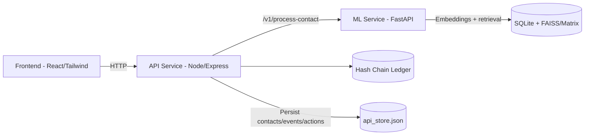
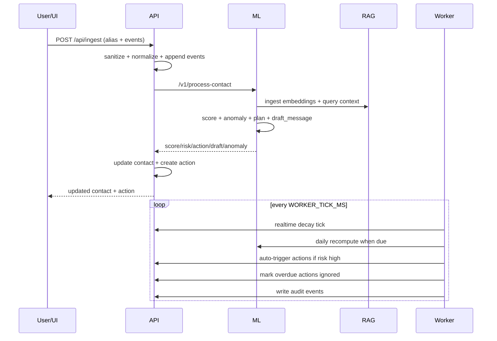

# bubbleOne

Privacy-first relationship management AI for the hackathon theme: **Social Life on Auto-Pilot**.

This repository is designed to be understandable for two audiences at once:
1. People new to AI/ML systems.
2. Engineers and judges who want implementation-level details.

---

## 1) What This Project Is

`bubbleOne` is an autonomous relationship copilot that uses **communication metadata** (not raw chat text) to:
- estimate relationship health over time,
- detect anomalies (drop-offs, negative sentiment patterns),
- retrieve relevant historical context from vector memory,
- recommend or auto-trigger follow-up actions,
- generate short draft messages,
- learn from user feedback (sent vs ignored actions),
- maintain an optional immutable audit chain of key events.

The system is intentionally built as a pragmatic hackathon MVP:
- modular microservices,
- locally runnable in Docker,
- OpenAI defaults for speed,
- local fallback options for privacy.

---

## 2) Core Concepts (Beginner Friendly)

If you are new to this domain, these are the key ideas behind the project.

### 2.1 Metadata vs Raw Text
- **Raw text** = actual message contents (private, sensitive).
- **Metadata** = timestamp, interaction type, sentiment estimate, intent, summary, etc.

bubbleOne uses metadata + short abstractive summaries and explicitly avoids storing raw messages.

### 2.2 Relationship Health Score
A numeric score from `0` to `100` representing current relationship momentum.
- High score: relationship is warm/active.
- Mid score: fading, needs attention.
- Low score: critical, should intervene soon.

### 2.3 Temporal Decay
Relationships weaken when there is no interaction. We model this as an exponential decay:

`R_new = (R_old * exp(-lambda * delta_t)) + interaction_impact`

Where:
- `lambda` controls how fast relationship strength decays,
- `delta_t` is elapsed time,
- `interaction_impact` adds/subtracts value based on interaction quality.

### 2.4 RAG (Retrieval-Augmented Generation)
Instead of only asking an LLM blindly, we retrieve relevant historical memory first.
- We embed summaries into vectors.
- We query similar summaries for the same contact.
- We pass this context into planning.

Result: more grounded recommendations.

### 2.5 LangGraph Workflow
We orchestrate decision logic as graph nodes:
- anomaly analysis,
- RAG lookup,
- action planning,
- scheduling.

This gives structure and predictability compared to a single monolithic prompt.

### 2.6 Reinforcement Loop (Lightweight)
System behavior adapts from outcomes:
- if user sends draft: increase positive weighting and slightly slow decay,
- if user ignores draft: decrease weighting and slightly speed decay.

This is a simple practical learning loop suitable for MVP timelines.

---

## 3) Product Goals and Constraints

### Goals
- autonomous follow-up logic,
- high demo clarity for judges,
- ML-heavy decisioning with visible automation depth,
- practical local deployment.

### Constraints
- no raw message text persistence,
- synthetic dataset for demo,
- single-developer 12-hour feasible architecture,
- easy local run and quick demo cycle.

---

## 4) High-Level Architecture



### Why this architecture
- **Frontend** stays focused on UX and user actions.
- **API service** handles orchestration, persistence, state transitions, and worker automation.
- **ML service** isolates ML logic (scoring, embeddings, LangGraph flow).
- This separation makes judging easier: each layer has clear responsibility.

---

## 5) Repository Structure and What Each Part Does

## 5.1 Root
- `docker-compose.yml`: brings up `frontend`, `api`, `ml`.
- `.env.example`: all runtime knobs.
- `scripts/run_all.sh`: one-command local startup.
- `scripts/demo_run.sh`: quick demo seed + snapshots.
- `scripts/verify.sh`: sanity checks (compose config, compile, tests, generator smoke).

## 5.2 `services/frontend`
- React + TypeScript + Tailwind app.
- Displays relationship feed, score/risk badges, action center, privacy toggle.
- Calls API routes for ingest, draft, send, ignore, auto-nudge.

## 5.3 `services/api`
- Main orchestrator and system-of-record.
- Stores contacts, actions, events, worker metadata in `api_store.json`.
- Starts background autonomous worker.
- Maintains optional audit hash chain.

## 5.4 `services/ml`
- FastAPI ML endpoints.
- Scoring function with temporal decay.
- Embedding client (OpenAI with local/hash fallback).
- RAG store integration.
- LangGraph action planning flow.

## 5.5 `docs`
Focused docs for scoring, RAG schema, flow specs, prompts, and talking points.

---

## 6) Detailed Data Model

## 6.1 Metadata Event
Each event includes:
- `timestamp (ts)`
- `contact_hash`
- `interaction_type` (`text`, `call`, `ignored_message`, `auto_nudge`, `missed_call`)
- `sentiment` in `[-1, 1]`
- `intent`
- `summary` (abstractive short summary)
- `metadata` dictionary

Privacy guardrails strip raw-text-like keys:
- `raw_message`
- `message_text`
- `full_text`
- `chat_text`

## 6.2 Contact Record
Per contact we track:
- score fields (`previousScore`, `currentScore`, `band`, `riskLevel`)
- recommendation and draft content
- anomaly flags/reason
- event counts and timestamps
- auto-nudge settings
- adaptive tuning state:
  - `interactionMultiplier`
  - `lambdaDecay`
  - `positiveFeedback`
  - `negativeFeedback`

## 6.3 Action Item
- action type (`draft`, `draft_and_schedule`, `reminder`, `deprioritize`, etc.)
- text content
- origin (`user` or `auto`)
- status (`pending`, `completed`, `ignored`)
- scheduling and completion timestamps

## 6.4 Worker Meta
- last daily recompute time
- last worker tick time
- count of auto-runs

---

## 7) End-to-End Runtime Flow



---

## 8) Scoring System (Math + Reasoning)

## 8.1 Formula
`R_new = (R_old * exp(-lambda * delta_t)) + interaction_impact`

### Components
- `R_old`: previous relationship score
- `lambda`: decay coefficient (adaptive)
- `delta_t`: elapsed time in days
- `interaction_impact`: weighted effect of event

### Bounds
Score is clamped to `[0, 100]`.

## 8.2 Interaction Impact
Impact combines:
- interaction type weight
- intent weight
- sentiment term
- recency multiplier
- per-contact interaction multiplier (learned)

### Type weights (default)
- `call`: +8.0
- `text`: +4.0
- `ignored_message`: -7.0
- `auto_nudge`: +2.0
- `missed_call`: -3.0

### Recency
Older events have lower influence via exponential recency factor.

## 8.3 Adaptive Decay Training
`train_temporal_decay` adjusts lambda from observed event cadence:
- larger/irregular gaps => slightly faster decay,
- denser cadence => slower decay,
- bounded into `[0.03, 0.2]`.

## 8.4 Why this design
- mathematically simple,
- interpretable by judges,
- robust for sparse metadata,
- easy to explain and debug.

---

## 9) Anomaly Detection

An anomaly is raised when any of the following holds:
- sharp score drop (`>= 15` points),
- recent negative sentiment signal (`<= -0.35`),
- interaction frequency drop (recent week significantly below prior week).

Anomaly reason is labeled as:
- `frequency_drop`
- `drop_and_negative_sentiment`
- `score_drop`
- `negative_sentiment`
- `none`

Why this matters:
- anomalies directly escalate priority,
- anomalies influence risk level,
- anomalies can auto-trigger check-in drafts.

---

## 10) LangGraph Orchestration (Decision Brain)

Nodes:
1. `analyze_anomaly`
2. `query_rag` (conditional)
3. `plan_action`
4. `schedule_action`

Routing logic:
- if anomaly detected => go through `query_rag` before planning,
- else go directly to planning.

Output fields include:
- `recommended_action`
- `draft_message` (1-2 sentence tone-aware)
- `action_type`
- `priority`
- `schedule_at`
- anomaly flags/reason

Why LangGraph:
- transparent node-level control,
- deterministic orchestration around LLM,
- easy insertion of additional checks later.

---

## 11) RAG Memory Design

What is stored:
- event id
- contact hash
- summary
- metadata JSON
- timestamp
- embedding vector

What is not stored:
- raw messages/chat transcripts

Storage strategy:
- metadata/doc rows in SQLite (`rag.sqlite`)
- vector index in FAISS (`rag.index`) when available
- fallback matrix (`rag.matrix.npy`) if FAISS unavailable

Why this approach:
- local-first and inspectable,
- resilient fallback behavior,
- enough retrieval quality for MVP context grounding.

---

## 12) API Routes and Their Responsibilities

## 12.1 Health
- `GET /health`
- returns API status + ML reachability summary.

## 12.2 Ingestion and Scoring
- `POST /api/ingest`
- validates payload, normalizes events, updates local store,
- calls ML `/v1/process-contact`,
- updates contact record and creates pending action (if not duplicate auto type),
- appends audit block.

## 12.3 Dashboard
- `GET /api/dashboard`
- returns contacts, pending actions, aggregate metrics, worker meta.

## 12.4 Action APIs
- `POST /api/actions/draft`
  - creates draft using ML-generated `draftMessage` (with fallback).
- `POST /api/actions/send`
  - marks complete, applies positive feedback for draft-like actions.
- `POST /api/actions/ignore`
  - marks ignored, applies negative feedback for draft-like actions.
- `POST /api/actions/auto-nudge`
  - toggles auto-nudge mode and may create reminder action.

## 12.5 Audit
- `GET /api/audit/chain`
- returns chain validity and blocks.

---

## 13) Autonomous Worker (Background Automation)

The worker is started automatically when API boots.

Tick loop (`WORKER_TICK_MS`, default 15s):
1. update worker tick metadata,
2. apply real-time score decay,
3. sweep overdue pending actions and auto-ignore after threshold,
4. run daily recompute (once per day),
5. trigger new auto actions when conditions match.

Auto-trigger conditions:
- score below threshold,
- high risk,
- frequency drop anomaly,
- or auto-nudge enabled with moderate decay.

Safety controls:
- cooldown window per contact (`AUTO_ACTION_COOLDOWN_HOURS`),
- skip if similar pending auto action exists,
- bounded tuning parameters.

---

## 14) Feedback Loop (Self-Evolving Behavior)

Positive path:
- User sends a draft/action.
- `interactionMultiplier` increases by `+0.05` (max `2.0`).
- `lambdaDecay` decreases by `-0.005` (min `0.03`).

Negative path:
- User ignores action (or auto-ignore for overdue).
- `interactionMultiplier` decreases by `-0.05` (min `0.5`).
- `lambdaDecay` increases by `+0.005` (max `0.2`).

Interpretation:
- system becomes more proactive where positive engagement exists,
- system decays faster and deprioritizes where engagement is weaker.

---

## 15) UI Walkthrough (What You See and What It Means)

The current frontend uses a social-feed pattern.

## 15.1 Top Bar
- Brand and navigation shell.
- Privacy switch (visual mode toggle). Demonstrates privacy focus in UX narrative.

## 15.2 Left Sidebar (Overview)
- Key metrics: contacts, avg health, critical count, pending actions.
- Worker status: live tick freshness and auto-run count.
- Quick synthetic seed buttons for fast demo setup.

## 15.3 Center Feed (Relationship Orbit Stream)
Each contact card shows:
- alias + avatar initial,
- current score and delta,
- health band + risk badge,
- recommendation text,
- anomaly indicator if present,
- score progress bar,
- actions: `Draft + Send`, `Enable/Disable Auto-Nudge`.

## 15.4 Right Rail (Action Center)
Pending queue with:
- action text,
- type and origin,
- `Ignore` and `Complete` controls.

## 15.5 Draft Modal
- shows generated message draft,
- lets user close or mock-send,
- sending closes loop and updates tuning.

---

## 16) Privacy and Security Posture

Privacy-first controls in implementation:
- raw text fields stripped at ingest,
- only metadata + summaries + embeddings persisted,
- contact alias hashed for IDs,
- audit ledger stores hashes, not payload plaintext.

Operational notes:
- OpenAI mode sends model inputs to remote APIs (fastest for demo).
- Local mode available for private/air-gapped style demos.

---

## 17) Why Each Technology Was Chosen

Frontend (`React + TS + Tailwind + Vite`)
- fast iteration and responsive UI control.

API (`Node + Express + TypeScript`)
- straightforward orchestration and fast developer velocity.

ML Service (`Python + FastAPI`)
- natural environment for scoring, embeddings, and graph orchestration.

LangGraph
- explicit, testable control flow for LLM-heavy decision logic.

RAG (`SQLite + FAISS fallback`)
- local, simple, and sufficient retrieval quality for MVP.

Docker Compose
- one-command reproducible environment for judges.

---

## 18) Lifecycle: How the Project Evolved

Phase 1: Scaffold
- established service split and docker setup,
- baseline scoring + ingest + dashboard.

Phase 2: Privacy hardening
- enforced metadata-only constraints,
- removed/stripped raw-message fields,
- added hashed identity patterns.

Phase 3: ML depth
- integrated LangGraph flow + RAG retrieval,
- action planning with OpenAI/local fallback.

Phase 4: Autonomous engine
- added background worker (real-time decay, daily recompute, auto-triggering).

Phase 5: Learning loop
- feedback-based weight tuning (send reward / ignore penalty).

Phase 6: Draft quality
- extended ML schema with `draft_message`,
- routed `/api/actions/draft` through ML output.

Phase 7: Reliability and polish
- async route error handling and resilience,
- demo script readiness wait,
- iterative UI redesign into social-feed style.

Key implementation fixes made during lifecycle:
- OpenAI embedding failure now falls back locally,
- API async error crashes replaced with controlled 502/500 paths,
- worker race/resilience improvements,
- accessibility + UI consistency pass.

---

## 19) Run, Verify, Demo

## 19.1 Prerequisites
- Docker Desktop running.
- Optional: OpenAI key in `.env`.

## 19.2 Start
```bash
./scripts/run_all.sh
```
Or:
```bash
docker compose up --build
```

## 19.3 Health checks
- `http://localhost:8000/health`
- `http://localhost:8001/health`
- UI: `http://localhost:3000`

## 19.4 Demo seed
```bash
./scripts/demo_run.sh
```

## 19.5 Verification
```bash
./scripts/verify.sh
```

## 19.6 ML tests
```bash
docker compose run --rm ml pytest -q
```

---

## 20) Environment Variables (Important)

Core:
- `OPENAI_API_KEY`
- `OPENAI_MODEL` (default `gpt-4o-mini`)
- `OPENAI_EMBED_MODEL` (default `text-embedding-3-small`)
- `LLM_PROVIDER` (`openai` or `local`)
- `EMBEDDING_PROVIDER` (`openai` or `local`)
- `LOCAL_LLM_URL`

Worker automation knobs:
- `WORKER_TICK_MS`
- `AUTO_DRAFT_THRESHOLD`
- `AUTO_ACTION_COOLDOWN_HOURS`
- `AUTO_IGNORE_HOURS`

Audit:
- `BLOCKCHAIN_AUDIT=true|false`

---

## 21) Known Limitations

- Lightweight heuristic feedback loop (not full RL training).
- In-memory/runtime operational assumptions for a hackathon scope.
- RAG quality limited by synthetic summaries and event volume.
- No real messaging provider integration (send is mock completion).
- Single-node deployment (not yet production distributed infra).

---

## 22) Suggested Next Steps (Post-Hackathon)

1. Integrate real messaging/calendar APIs with consent controls.
2. Add robust auth and tenant isolation.
3. Add policy layer for quiet hours and user boundaries.
4. Add offline local LLM bundle profile for full private mode.
5. Expand evaluation suite (precision of triggers, false positives, action acceptance rate).
6. Add richer temporal models and per-contact embeddings lifecycle management.

---

## 23) Quick File Guide (Key Files)

API:
- `services/api/src/index.ts`: app bootstrap + worker startup
- `services/api/src/routes/index.ts`: all external endpoints
- `services/api/src/store/store.ts`: persistence + tuning + decay mechanics
- `services/api/src/worker/autonomousWorker.ts`: automation loop
- `services/api/src/audit/chain.ts`: optional immutable event chain

ML:
- `services/ml/app/main.py`: FastAPI ML routes
- `services/ml/app/scoring.py`: math model + temporal training
- `services/ml/app/langgraph_flow.py`: orchestration graph
- `services/ml/app/llm_clients.py`: OpenAI/local planning + fallback
- `services/ml/app/embeddings.py`: embedding provider + fail-open fallback
- `services/ml/app/rag_store.py`: SQLite + vector index retrieval

Frontend:
- `services/frontend/src/App.tsx`: complete dashboard UI
- `services/frontend/src/api.ts`: API client methods
- `services/frontend/src/styles.css`: visual system and components

Demo & infra:
- `docker-compose.yml`
- `scripts/demo_run.sh`
- `scripts/verify.sh`

---

## 24) One-Paragraph Project Summary

bubbleOne is a privacy-first autonomous relationship copilot that transforms metadata into actionable social intelligence. It combines an interpretable temporal scoring model, anomaly detection, LangGraph-based decision orchestration, RAG memory retrieval, and a feedback loop that adapts behavior from user outcomes. The system runs as three Dockerized microservices with a social-style dashboard, supports OpenAI defaults for speed with local fallbacks for privacy, and demonstrates end-to-end automation depth suitable for hackathon judging.

---

## 25) Companion Readmes

- [PPT deck content and slide blueprint](/Users/manteksinghburn/bubbleOne/README_PPT.md)
- [Judge presentation playbook and mock Q&A](/Users/manteksinghburn/bubbleOne/README_JUDGES.md)
