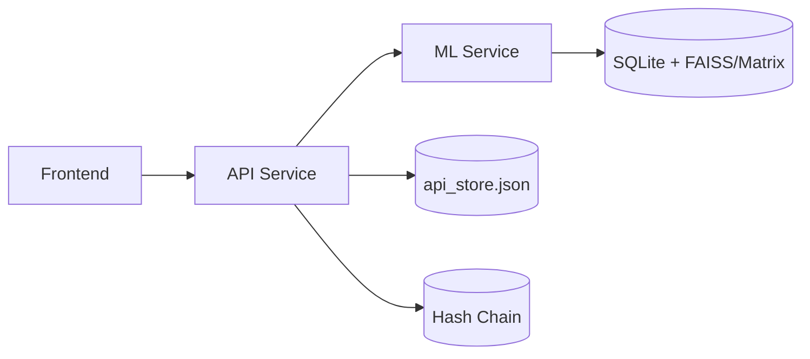
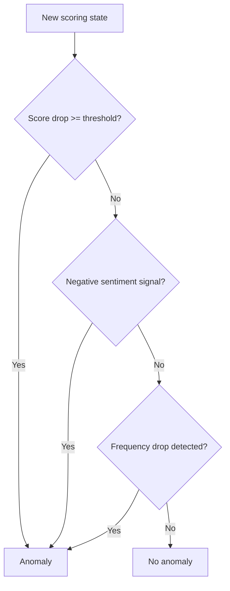
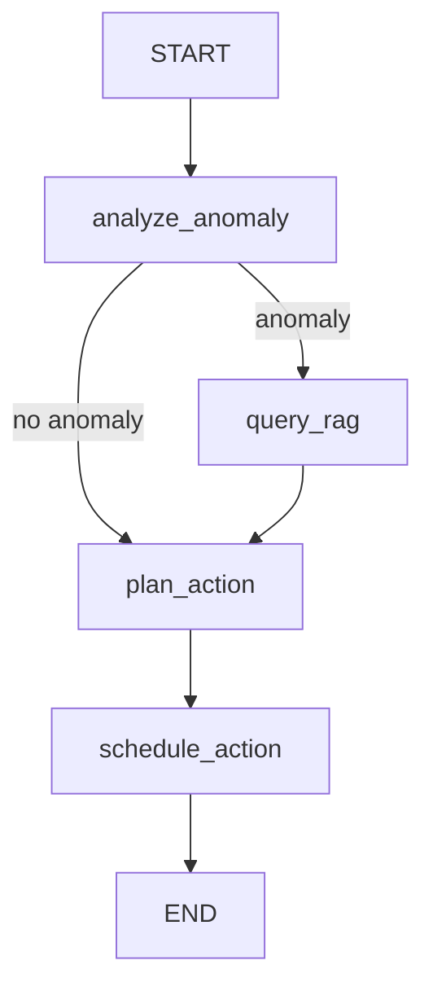
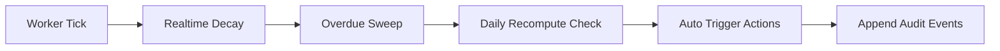

# bubbleOne PPT Guide

This file is a complete slide-by-slide script and content pack for building a polished presentation.

Use this as:
- structure for your deck,
- speaker script,
- source material for diagrams and flowcharts,
- checklist for what judges must see.

---

## Slide 1 - Title

**Title:** bubbleOne - Social Life on Auto-Pilot  
**Subtitle:** Privacy-first autonomous relationship intelligence

### Slide content
- Team: (your name)
- Hackathon track/challenge name
- One-line value proposition:
  - "Autonomous relationship management using metadata-only AI with explainable scoring and adaptive actions."

### Speaker notes
- Open with the problem: modern social relationships decay from neglect, not intent.
- Set positioning: this is not surveillance AI, it is consent-first and metadata-driven.

### Visual direction
- product logo + calm gradient background
- short architecture teaser graphic in corner

---

## Slide 2 - Problem Statement

**Title:** The Problem We Solved

### Slide content
- People forget to maintain relationships.
- Existing reminders are too static and context-blind.
- Most AI assistants require raw message content (privacy concern).

### Speaker notes
- Explain the gap: generic reminder apps do not adapt to real relationship dynamics.
- Emphasize trust issue: users do not want private chat logs stored.

### Diagram idea
- simple cause-effect flow:
  - busy life -> missed interactions -> silent drift -> weaker relationships

---

## Slide 3 - Solution Summary

**Title:** What bubbleOne Does

### Slide content
- Ingests communication metadata (timestamps, type, sentiment, intent, summary).
- Computes relationship health scores over time.
- Detects anomalies (drop-offs/negative patterns).
- Auto-generates actions and drafts.
- Learns from user feedback.

### Speaker notes
- Mention this is an autonomous loop, not a one-shot suggestion generator.

### Diagram idea
- 5-box pipeline strip:
  - Ingestion -> Scoring -> Anomaly -> Decision -> Action

---

## Slide 4 - Why This Is Different

**Title:** Differentiators

### Slide content
- Privacy-first by design (no raw message persistence).
- Explainable scoring math, not black-box only.
- LangGraph orchestration with RAG grounding.
- Adaptive reinforcement loop from user outcomes.
- Background automation (daily recompute + real-time decay).

### Speaker notes
- Connect each differentiator to judge criteria: novelty, depth, reliability, practicality.

---

## Slide 5 - User Story

**Title:** Real User Journey

### Slide content
- User has 5 close contacts.
- bubbleOne tracks metadata from interactions.
- A frequency drop with one contact is detected.
- System drafts check-in automatically.
- User sends it -> model adjusts positively.

### Speaker notes
- Tell one narrative end-to-end.
- Keep this story consistent across demo.

---

## Slide 6 - Architecture Overview

**Title:** System Architecture

### Slide content
- Frontend: React/TypeScript/Tailwind
- API Service: Node/Express/TypeScript
- ML Service: Python/FastAPI/LangGraph
- Data: JSON store + SQLite + vector index

### Diagram (use directly)

### Speaker notes
- Explain separation of concerns.
- Mention this split enabled fast development and clean debugging.

---

## Slide 7 - Privacy Architecture

**Title:** Privacy by Construction

### Slide content
- Raw text keys stripped at ingest.
- Only metadata, summaries, embeddings persisted.
- Contact identities hashed.
- Optional audit chain stores hashes only.

### Diagram idea
- table with "Allowed" vs "Blocked" data.

### Speaker notes
- Repeat: no raw chat text storage in DB.

---

## Slide 8 - Data Model

**Title:** Core Data Objects

### Slide content
- `MetadataEvent`
- `ContactRecord`
- `ActionItem`
- `WorkerMeta`

### Suggested table columns
- Object
- Key fields
- Why needed

### Speaker notes
- Show how each object maps to UI and automation behavior.

---

## Slide 9 - Scoring Model

**Title:** Relationship Health Scoring

### Slide content
- Formula:
  - `R_new = (R_old * exp(-lambda * delta_t)) + interaction_impact`
- Banding:
  - Good >= 75
  - Fading 45-74
  - Critical < 45
- Hard guardrails: score clamped to [0, 100]

### Speaker notes
- Explain why exponential decay matches relationship dynamics.
- Explain why simple interpretable math is strong for MVP trust.

### Diagram idea
- line chart: score decay with and without interaction events.

---

## Slide 10 - Adaptive Tuning

**Title:** Self-Adjusting Behavior

### Slide content
- Positive feedback (send action):
  - interaction multiplier +0.05
  - decay lambda -0.005
- Negative feedback (ignore action):
  - interaction multiplier -0.05
  - decay lambda +0.005
- Bounds enforced to prevent instability.

### Speaker notes
- This is lightweight reinforcement suitable for hackathon delivery.
- It demonstrates "learning" without overclaiming deep RL.

---

## Slide 11 - Anomaly Detection

**Title:** Anomaly Trigger System

### Slide content
Anomaly fires if:
- score drops sharply,
- strong negative sentiment appears,
- interaction frequency drops week-over-week.

### Speaker notes
- Explain anomaly reason labels for explainability.

### Flowchart (use directly)

---

## Slide 12 - LangGraph Decision Flow

**Title:** Orchestration Graph

### Slide content
Nodes:
- analyze_anomaly
- query_rag (conditional)
- plan_action
- schedule_action

### Diagram (use directly)

### Speaker notes
- Highlight deterministic control around LLM calls.

---

## Slide 13 - RAG Design

**Title:** Context Retrieval

### Slide content
- Embeds summaries into vectors.
- Queries similar history for same contact.
- Injects retrieved context into planner.

### Speaker notes
- This reduces generic suggestions and adds continuity.

### Diagram idea
- summary chunk -> embedding -> vector search -> context snippets -> prompt.

---

## Slide 14 - Autonomous Worker

**Title:** Background Automation Loop

### Slide content
Every tick:
- apply real-time decay,
- sweep overdue actions,
- run daily recompute (when due),
- auto-trigger actions on risk/anomaly.

### Diagram (use directly)

### Speaker notes
- Emphasize no user click needed for automation.

---

## Slide 15 - API Surface

**Title:** Product API Endpoints

### Slide content
- `POST /api/ingest`
- `GET /api/dashboard`
- `POST /api/actions/draft`
- `POST /api/actions/send`
- `POST /api/actions/ignore`
- `POST /api/actions/auto-nudge`
- `GET /api/audit/chain`

### Speaker notes
- Mention route-level purpose briefly.

---

## Slide 16 - UI Walkthrough

**Title:** Frontend Experience

### Slide content
- Top bar: branding + privacy control
- Left rail: metrics + worker status + quick seed
- Center feed: contact cards with score/risk/anomaly + actions
- Right rail: pending action queue
- Draft modal: generated message and send flow

### Speaker notes
- Tie each UI region to backend state objects.

### Visual direction
- screenshot with numbered callouts (1..5)

---

## Slide 17 - Demo Script (Live)

**Title:** 5-Minute Live Demo Plan

### Slide content
1. Open dashboard and explain panels.
2. Seed synthetic interactions.
3. Show scores and actions update.
4. Trigger draft and send.
5. Ignore another action and show adaptation.
6. Show audit chain endpoint.

### Speaker notes
- Keep pace tight; avoid long terminal output.
- Always narrate "what changed and why".

---

## Slide 18 - Engineering Lifecycle

**Title:** Project Evolution

### Slide content
- Base scaffold and scoring engine.
- Privacy hardening and schema enforcement.
- LangGraph + RAG integration.
- Autonomous worker and reinforcement loop.
- ML draft_message integration.
- UI iterations to social-feed polish.

### Speaker notes
- Demonstrate continuous refinement and debugging maturity.

---

## Slide 19 - Reliability and Validation

**Title:** Testing and Verification

### Slide content
- unit tests for scoring and bounds
- docker compose checks
- compile checks for ML + frontend + API
- synthetic generator smoke tests

### Speaker notes
- Mention reproducibility and one-command run.

---

## Slide 20 - Results and Impact

**Title:** Why bubbleOne Matters

### Slide content
- Reduces social drift through adaptive nudges.
- Preserves privacy by avoiding raw transcript storage.
- Demonstrates autonomous ML workflow beyond simple chatbot UX.

### Speaker notes
- End with product potential: wellness, retention, personal CRM, coaching.

---

## Slide 21 - Roadmap

**Title:** What Comes Next

### Slide content
- integrations (calendar/messaging)
- richer personalization
- policy/consent controls
- production-grade auth and observability
- advanced outcome optimization

### Speaker notes
- Distinguish MVP-ready vs production-ready roadmap.

---

## Slide 22 - Q&A Backup

**Title:** Backup Slides (Keep Hidden)

### Suggested backup slides
- detailed scoring formula derivation
- full architecture diagram
- privacy model and threat assumptions
- fallback behavior when OpenAI unavailable
- API payload examples

---

## Diagram Prompt Pack (for PPT Designer Tools)

Use these prompts in Figma AI, Gamma, Tome, or diagram tools.

### Prompt A - System Architecture Diagram
"Create a clean dark-theme architecture diagram with three services: frontend, api, ml. Show api_store and rag_store and audit chain as separate stores. Draw arrows: frontend->api, api->ml, ml->rag, api->api_store, api->audit. Style: modern SaaS, minimal glow, labels readable."

### Prompt B - Decision Flowchart
"Create a flowchart for an AI decision engine: analyze anomaly -> if anomaly then query context -> plan action -> schedule action -> output recommendation and draft. Include branch labels and compact style."

### Prompt C - Automation Loop
"Design a cyclic loop diagram titled Autonomous Worker: realtime decay, overdue sweep, daily recompute, auto trigger actions, ledger append. Use clockwise arrows and event icons."

### Prompt D - Scoring Graph
"Plot a line graph showing relationship score decay over time with periodic positive interactions raising the curve. Add formula R_new=(R_old*exp(-lambda*delta_t))+interaction_impact."

---

## Slide Build Checklist

Before final export:
- consistent color tokens and typography
- no more than 1 key message per slide
- all diagrams readable from distance
- demo flow rehearsed with timing
- fallback screenshots prepared
- final slide includes call to action

---

## Suggested Timing (8-10 minutes)

- Intro + problem: 1.5 min
- solution + architecture: 2 min
- scoring + ML logic: 2 min
- demo: 2.5 min
- impact + roadmap: 1 min
- Q&A: remainder

---

## One-Line Close

"bubbleOne turns passive relationship decay into an adaptive, privacy-safe, autonomous support system that learns from outcomes and acts before connections fade."
